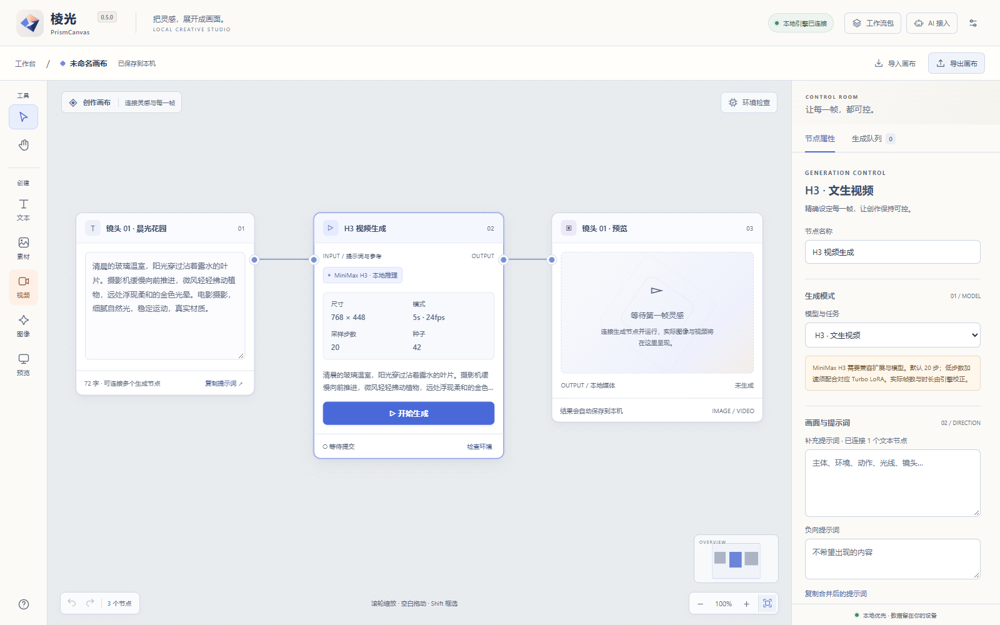

# 棱光 PrismCanvas

[返回项目总览](https://github.com/NOXEVYR/portfolio) · [仓库迁移说明](MIGRATION.md)

**AI 图片与视频生成画布，兼顾本地 AI 环境发现与检查。** 在画布上组织提示词、参考图、生成任务与结果，连接已有本地 ComfyUI 完成生成；发现并检查推理环境、模型依赖和后端状态。

以钴蓝、杏桃与暖灰构建的本地 AI 影像工作台。独立编写，无广告、账号、遥测或云端依赖；重点是 MiniMax H3 视频、Krea 2 / SDXL 图片控制、缺失项检查和可复现工作流。

> **0.5.0**：采用 E04 棱光切片图标，显示名称更新为「棱光 PrismCanvas」，重新组织项目工作条、创作工具、画布与参数面板。保留 AI 可调用的 14 个 MCP 工具、任务放入画布和节点空位布局。生成计算由用户已有的本地 ComfyUI 后端完成；客户端不包含模型、PyTorch 或 CUDA。Windows x64 便携版与源码见下方下载入口。



品牌改名不迁移数据：Python 包、API 标识、画布和工作流格式仍采用 FrameWeave，默认数据目录与浏览器存储键保留。现有画布、工作流包与 AI 连接配置继续兼容；便携包的入口是 `PrismCanvas.exe`。详见 [品牌与兼容说明](docs/BRAND.md)。

## 开始使用

**[下载 Windows 便携版](https://raw.githubusercontent.com/NOXEVYR/frameweave/main/releases/PrismCanvas-v0.5.0-Windows-x64.zip)** · [下载源码 ZIP](https://raw.githubusercontent.com/NOXEVYR/frameweave/main/releases/PrismCanvas-v0.5.0-source.zip) · [SHA-256 校验值](https://github.com/NOXEVYR/frameweave/blob/main/releases/SHA256SUMS.txt)

新版本源码、文档和下载包在本独立仓库维护。[v0.2.0 历史发行文件](https://github.com/NOXEVYR/portfolio/tree/main/frameweave/releases) 和原下载地址继续保留，详情见 [迁移说明](MIGRATION.md)。

Windows 用户完整解压 0.5.0 便携 ZIP 后，打开 `PrismCanvas.exe`。程序使用系统 Edge 的独立应用窗口；无需另装 Python，不另外捆绑 Chromium。没有 Edge 时使用默认浏览器。

1. 启动你的本地 ComfyUI 推理服务。
2. 棱光启动后自动发现本机后端，点击使用发现的服务；也可在右上角设置填写地址，例如 `http://127.0.0.1:8188`。
3. 添加已有模型根目录。棱光读取模型，不移动、下载或删除模型。
4. 点击“检查环境”，核实节点、模型角色、文件结构与待补齐项。
5. 创建提示词和生成节点，连线后调整参数，先试样，再提升规格。

源码运行只需要 Python 3.11+：

```sh
python launch.py
```

可选参数：`--backend http://127.0.0.1:8188`、`--model-root <绝对目录>`、`--comfy-root <已有 ComfyUI 安装目录>`、`--port 8765`、`--data-dir <目录>`、`--no-browser`。默认服务仅监听 `127.0.0.1`；当前不开放远程后端。

## 工作流包：填信息，生成图片或视频

在顶栏打开“工作流包”，导入 ComfyUI API JSON，或把当前已配置的 H3 / Krea / SDXL 生成节点封装成包。选择需要开放的提示词、种子、尺寸、步数等参数，保存后得到画布上的表单节点；填写信息即可提交生成，输出进入原有队列和结果预览。

参考图作为必填图片输入重新上传。包以带版本的 JSON 保存 API 图与参数映射，不包含模型、脚本或原始媒体；导出文件可分享，同一包重新导入能恢复画布关联。导入包本身不会启动生成。普通 ComfyUI 画布 JSON 需要先导出 API 格式。

详细步骤和分享范围见 [工作流包指南](docs/WORKFLOW_PACKAGES.md)。

包库可按名称、说明与 ID 搜索，将常用包收藏，把暂不用的包归档。归档仅隐藏常规列表中的条目，可随时恢复；已有画布仍可使用它。收藏与归档只存本机，不进入导出的分享文件。

## 画布和生成

- 无限画布：平移、鼠标锚点缩放、节点拖动、框选、端口连线、复制、删除、撤销重做、适配视图与小地图。
- 提示词：独立文本卡片、连接生成节点、一键复制。JSON 画布可导入导出，浏览器自动保存工作状态。
- 参考图：PNG / JPEG / WebP 上传到本机推理服务。H3 支持文生、首尾帧、1–9 张图像参考；视频和音频参考请使用专用 API 工作流。
- 控制：模式、模型、种子、尺寸、步数、CFG、采样器、调度器、LoRA、降噪、时长。H3 固定 24 fps，展示按 `17n+5` 对齐的真实帧数和时长。
- 图片：Krea 2 文生图与带兼容节点/LoRA的参考编辑、SDXL 文生图和图生图。参数与节点会在提交前校验。
- 队列：只追踪本客户端提交的任务，保存复现图、耗时、执行错误和输出；支持状态筛选与标题、ID、类型、错误搜索，刷新时复用未变化的缩略图。
- 参数复用：从历史任务创建独立生成节点，修改提示词或参数再运行。再次生成使用保存的精确 API 图与种子，并校验当前节点；同一次请求不会重复排队。详见 [任务历史指南](docs/TASK_HISTORY.md)。
- 预览：图片放大、视频播放与下载；关闭或更换预览时暂停并释放媒体源。输入即时保存，轮询不会覆盖尚未失焦的有效文本。
- 取消：支持原子按任务中断的后端可取消运行中任务；旧后端只取消排队任务，不调用会影响其他客户端的全局中断。
- 高级用户：导入 ComfyUI **API 格式** JSON 工作流。普通 ComfyUI UI 格式 JSON 需要先在 ComfyUI 导出为 API 格式。

## 缺失检查与 AI 协作

顶栏 **AI 接入**可复制本机 MCP 连接配置。支持 Streamable HTTP 的同机 AI 客户端可以查询环境、管理数据工作流包、校验与提交图片/视频生成、查询和取消任务。AI 创建的结果可从队列放入画布；接口不直接拖拽排版。连接方式、14 个工具和去重规则见 [AI 接口指南](docs/AI_INTERFACE.md)。

启动后自动检查少量本机候选端口、运行中的 ComfyUI、已识别安装位置和显卡信息；可在设置中补充自定义安装目录。按所选图片/视频工作流检查节点、模型角色、参考图、LoRA 和运行时证据，分别显示通过、缺失、错误、提醒和未知。后端未启动时不会把所有节点与模型误报为缺失。

存在、注册、包元数据、运行时与文件结构分别判断。**结构检查不等于全文件 SHA-256 校验，也不等于推理成功。**

检查只读取指定目录下被后端列举的模型，不递归扫整盘、不把权重读进内存。修复说明可复制给 AI，也可导出脱敏报告；默认不包含私人提示词、参考图或绝对模型路径，不自动执行 AI 建议。具体检测范围见 [环境检查指南](docs/ENVIRONMENT.md)。

## 本地数据与空间

Windows 配置、工作流包和任务复现图保存在 `%LOCALAPPDATA%/FrameWeave`，画布保存在本机浏览器站点存储。视频、图像仍由后端保存在其输出目录；客户端按块传输预览，不重复缓存大视频。迁移时分别导出画布 JSON 和工作流包。

关闭画布后，本地服务在约三分钟无访问后退出。后台生成不随窗口关闭而终止，重新打开可恢复本客户端任务记录。

浏览器存储按端口区分；如端口被占用，程序会换端口。请通过导出/导入迁移画布。初版尚无跨设备同步和完整项目资产归档。

## 性能、质量与范围

画布性能和生成性能分别优化：前端零依赖；本地服务零运行库依赖；模型继续共享用户已有后端。速度主要由模型、量化、显存、CPU offload、分辨率、帧数和步数决定，棱光不承诺提升模型自身画质或推理速度。

H3 先使用短片、固定种子和较低预览尺寸核实构图，再用约 1344×768 / 20 步做标准生成。4/8 步需要匹配的 Turbo LoRA；不能只减少步数就宣称保持质量。具体参数、模型许可和官方链接见 [模型指南](docs/MODELS.md)。

初版未实现完整剪辑时间线、音频编辑、超分、云端 API、付费服务、完整自定义节点编辑器或多用户服务。请参阅 [功能分析与边界](docs/ANALYSIS.md) 和 [验证报告](docs/VALIDATION.md)。

## 开发与许可

```sh
python -m unittest discover -s tests -v
node --test tests/*.test.mjs
python -m compileall -q frameweave
node --check web/app.js
```

Windows 打包使用 PyInstaller 6.22.2，见 [构建说明](docs/BUILD.md)。原创客户端采用 [MIT](LICENSE)。MiniMax H3、Krea 2 和其他模型遵守各自许可；第三方署名见 [THIRD_PARTY.md](THIRD_PARTY.md)。

项目分类：**本地化 AI 系统**。每轮工作保留 [开发记录](docs/DEVELOPMENT_LOG.md)；资产管理系统与工具类项目请见 [项目总览](https://github.com/NOXEVYR/portfolio)。
